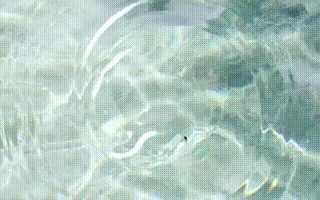

# Rippler

Ripplerは、要素に水面の波紋（リップル）エフェクトを生成する、依存関係のないJavaScriptライブラリです。このプロジェクトは、sirxemic氏によるオリジナルの[jquery.ripples](https://github.com/sirxemic/jquery.ripples)のフォークであり、jQueryへの依存をなくし、モダンなJavaScript標準（ES2023）で書き直されています。

WebGLを利用して高性能なレンダリングを行い、あらゆる背景画像に対してインタラクティブで視覚的に魅力的な水の効果を可能にします。

## 特徴

*   **依存関係なし**: jQueryやその他の外部ライブラリなしで動作します。
*   **高性能**: WebGLを使用し、ハードウェアアクセラレーションによる滑らかなアニメーションを実現します。
*   **高いカスタマイズ性**: 解像度、波紋の半径、乱れの強さなどを簡単に調整できます。
*   **インタラクティブ**: マウスの動きやタッチイベントに反応して波紋を生成します。
*   **簡単な使用方法**: 柔軟な設定オプションを備えたシンプルな初期化が可能です。

## デモ

`index.html`ファイルをウェブブラウザで開くことで、ライブデモを確認できます。

<!-- 以下にエフェクトのスクリーンショットやGIFアニメーションを追加できます -->
<!--  -->


## 使用方法

あなたのプロジェクトでRipplerを使用するには、以下の手順に従ってください：

1.  **リポジトリをクローンします:**
    ```bash
    git clone https://github.com/your-username/rippler.git
    cd rippler
    ```

2.  **スクリプトを読み込みます:**
    `rippler.js`と`main.js`スクリプトをHTMLファイルに追加します。`rippler.js`は初期化スクリプトの前に読み込むようにしてください。

    ```html
    <!DOCTYPE html>
    <html>
    <head>
        <!-- head内のコンテンツ -->
        <link rel="stylesheet" href="style.css">
    </head>
    <body>
        <div id="my-element" style="background-image: url(path/to/your/image.jpg);">
            <!-- コンテンツ -->
        </div>

        <script src="rippler.js"></script>
        <script>
            document.addEventListener('DOMContentLoaded', function() {
                const rippleElement = document.getElementById('my-element');
                if (rippleElement) {
                    const ripples = new Ripples(rippleElement, {
                        // オプション
                        resolution: 512,
                        dropRadius: 20,
                        perturbance: 0.04,
                    });
                }
            });
        </script>
    </body>
    </html>
    ```

3.  **ブラウザで開きます:**
    HTMLファイルをモダンなウェブブラウザで開くだけで、エフェクトを確認できます。

## 設定

`Ripples`コンストラクタは、以下のプロパティを持つオプションオブジェクトを受け付けます：

| プロパティ    | 型        | デフォルト値 | 説明                                                                          |
|---------------|-----------|--------------|-------------------------------------------------------------------------------|
| `resolution`  | `Number`  | `256`        | WebGLテクスチャの解像度。値が高いほど詳細ですが、パフォーマンスは低下します。 |
| `dropRadius`  | `Number`  | `20`         | 波紋の半径。                                                                  |
| `perturbance` | `Number`  | `0.03`       | 波紋による歪みの量。                                                          |
| `interactive` | `Boolean` | `true`       | エフェクトをインタラクティブにするかどうか（マウスやタッチに反応させるか）。    |
| `imageUrl`    | `String`  | `null`       | CSSを上書きして背景として使用する画像のURL。                                  |
| `crossOrigin` | `String`  | `""`         | URLから背景画像を読み込む際のcross-origin属性。                               |

## コントリビューション

コントリビューションを歓迎します。提案やバグの報告がある場合は、まずIssueを立てて議論してください。プルリクエストも歓迎します。

1.  このリポジトリをフォークします。
2.  新しいブランチを作成します (`git checkout -b feature/your-feature-name`)。
3.  変更をコミットします (`git commit -m 'Add some feature'`)。
4.  ブランチにプッシュします (`git push origin feature/your-feature-name`)。
5.  新しいプルリクエストを作成します。

## ライセンス

このプロジェクトはMITライセンスのもとで公開されています。
このプロジェクトはフォークであるため、元の作品である[jquery.ripples](https://github.com/sirxemic/jquery.ripples)のライセンスに従います。
詳細は[LICENSE](LICENSE)ファイルをご覧ください。

## プロジェクト内で使用されているアセットのライセンス

- Photo by [Marissa Rodriguez](https://unsplash.com/@marissar_?utm_source=unsplash&utm_medium=referral&utm_content=creditCopyText) on [Unsplash](https://unsplash.com/photos/2mKYEVGA4jE?utm_source=unsplash&utm_medium=referral&utm_content=creditCopyText)

